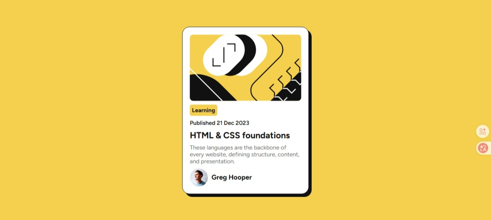

# Frontend Mentor - Blog preview card solution

This is a solution to the [Blog preview card challenge on Frontend Mentor](https://www.frontendmentor.io/challenges/blog-preview-card-ckPaj01IcS). Frontend Mentor challenges help you improve your coding skills by building realistic projects.

## Table of contents

- [Overview](#overview)
  - [Screenshot](#screenshot)
  - [Links](#links)
- [Author](#author)

## Overview

### Screenshot

### Links

- Solution URL: [https://github.com/joelavj/Carte-d-aper-u-du-blog](https://github.com/joelavj/Defi-Frontend-Mentor/tree/main/Carte%20d'aper%C3%A7u%20du%20blog)
- Live Site URL: [https://joelavj.github.io/Carte-d-aper-u-du-blog/](https://joelavj.github.io/Defi-Frontend-Mentor/Carte%20d'aper%C3%A7u%20du%20blog/index.html)
## Author

- Github - [Joela](https://github.com/joelavj)
- Frontend Mentor - [@joelavj](https://www.frontendmentor.io/profile/joelavj)
