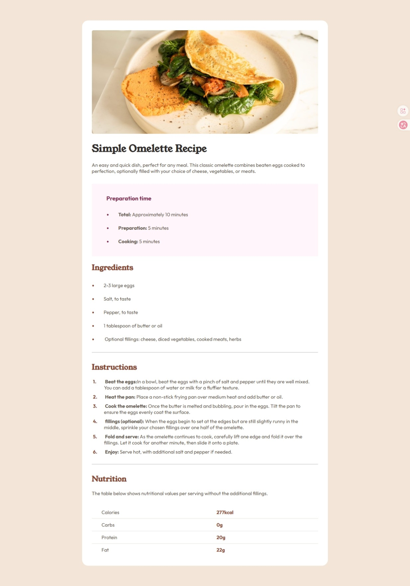

# Page de recette

Cette page web est une solution au defi organisé par [Frontend Mentor](https://www.frontendmentor.io/challenges/recipe-page-KiTsR8QQKm)

## Table des matières

- [Aperçu](#aperçu)
  - [Capture d'écran](#capture-décran)
  - [Liens](#liens)
- [Auteur](#auteur)

## Aperçu

### Capture d'écran

### Liens

- Solution URL: [https://github.com/joelavj/Page-de-recette](https://github.com/joelavj/Page-de-recette)
- Live Site URL: [https://joelavj.github.io/Page-de-recette/](https://joelavj.github.io/Page-de-recette/)

## Auteur

- Github - [https://github.com/joelavj](https://github.com/joelavj)
- Mentor frontend - [@joelavj](https://www.frontendmentor.io/profile/joelavj)
